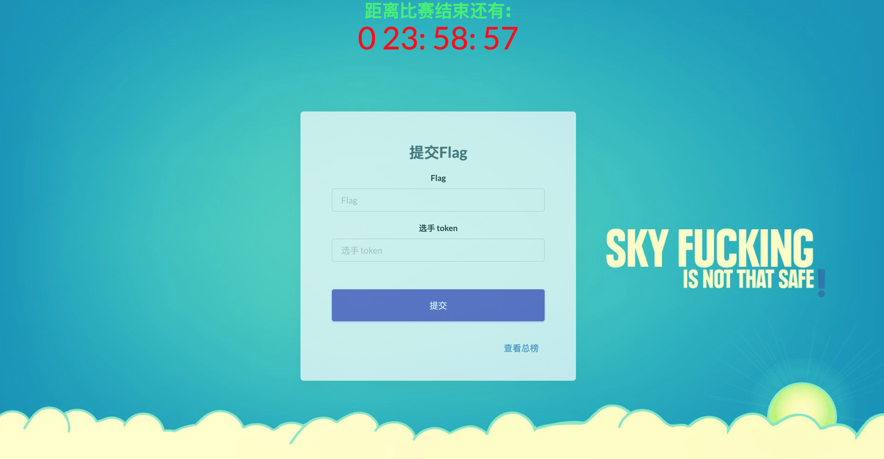
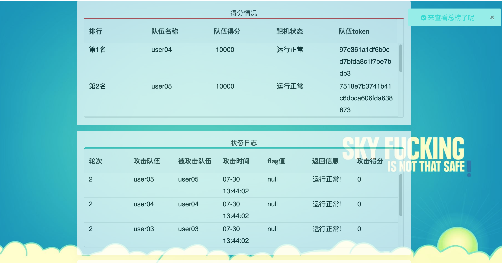

# CTF-AWD 训练平台

[TOC]

## 项目简介

一个简单的CTF-AWD平台，用于内部小型CTF对抗训练以及培训使用。






## 特点

- docker化，简易部署
- 可部署在公网上，远程AWD攻防
- 训练环境可自定义扩展


## 基本使用方式

### pre.py

```bash
python pre.py web_chinaz 10
```

web_chinaz 为应用文件名称，10表示要生成的队伍数量


### start.py

```bash
python start.py 10 
```

启动10个实例，以及check和flag服务。


### stop_clean.py

```bash
python stop_clean.py
```

暂停所有服务，并删除临时文件

>  注意，这里会删除所有现运行的容器，请谨慎使用。


### pass.txt

存储队伍用户名密码，以及ssh、web端口

```bash
team01	ctf:308d66	ssh:2201	port:8801
team02	ctf:024b1d	ssh:2202	port:8802
team03	ctf:d5cbcc	ssh:2203	port:8803
team04	ctf:e29190	ssh:2204	port:8804
```


### Host.list

用户以及内网ip的对应关系


### Write_ups

包含各类环境的WP


### Web_xxx

预置四个Web环境（web_chinaz,web_simplecms,web_gotsctf2018,web_javatsctf2018ss)。

xxx代表环境名称。

如果为二进制，预期名称为Bin_xxx.


### 细化说明

https://github.com/m0xiaoxi/AWD_CTF_Platform/blob/master/doc/


## 致谢

- [Zhl20018#awd-platform](https://github.com/zhl2008/awd-platform)
- [Henryzhao#gotsctf2018](https://github.com/Henryzhao96)
- [Wulasite#javatsctf2018](https://github.com/wulasite)
- [HECTF#awd_platform](https://github.com/HECTF/awd_platform)

# License

The AWD_CTF_Platform is released under the [GPLv3](https://github.com/m0xiaoxi/AWD_CTF_Platform/blob/master/LICENSE)